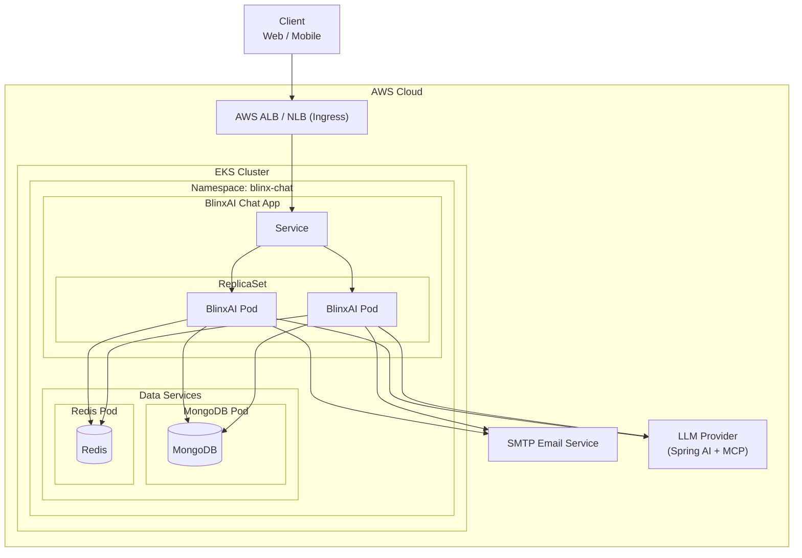
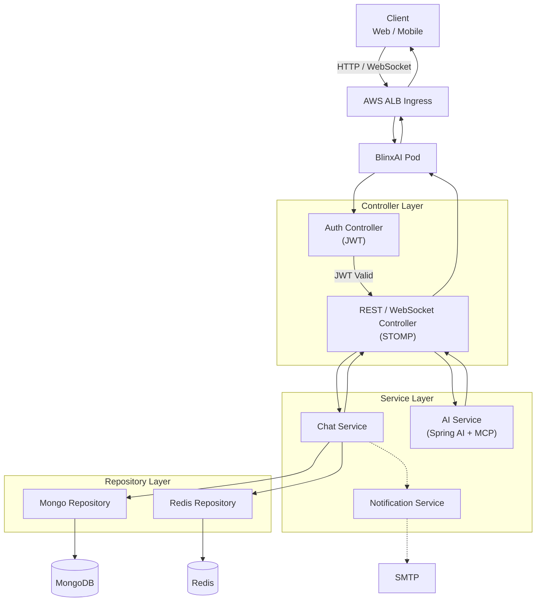

# BlinxAI - AI-Powered Real-Time Chat Application

[](https://www.oracle.com/java/)
[](https://spring.io/projects/spring-boot)
[](https://reactjs.org/)
[](https://www.mongodb.com/)
[](https://redis.io/)
[](https://aws.amazon.com/)
[](https://kubernetes.io/)
[](https://www.docker.com/)
[](https://stomp.github.io/)
[](https://jwt.io/)

Hey there! 👋 Welcome to **BlinxAI**, my personal project that I've been working on to explore the fascinating world of real-time communication combined with AI capabilities. This isn't just another chat app - it's a full-featured messaging platform with some really cool AI integration that makes conversations smarter and more interactive.

## ✨ What Makes This Special

The star of the show here is the **AI integration using MCP (Model Context Protocol)**. I spent quite a bit of time figuring out how to make AI feel natural in a chat environment. The system can understand context, provide intelligent responses, and even help moderate conversations. It's not just bolted-on AI - it's deeply integrated into the chat experience.

Beyond that, I've built in some practical features that I think make this app really useful:

- **Real-time messaging** with WebSocket connections that feel instant
- **Chat Suggestion** Ai based real time chat suggestion
- **Video calling** capabilities for face-to-face conversations (in future)
- **Smart scheduling** - the app automatically cleans up old chat data to keep things running smoothly
- **Rate limiting** using Redis to prevent spam and ensure fair usage
- **Efficient pagination** for chat history so you can scroll through thousands of messages without lag
- **File sharing** with proper validation and storage
- **Email notifications** with beautiful HTML templates
- **Two different frontend implementations** - one for learning different approaches

## 🖼️ Screenshots

Here's what the app looks like in action:

| Login | Signup |
|------|--------|
|  |  |

| AI Chat | MCP Capabilities | Chat Page |
|--------|------------------|-----------|
|  |  |  |

| Profile | Theme |
|--------|-------|
|  |  |

*These screenshots show the actual application - I'll add them to the screenshots(ss)/ folder*

## 🏗️ Architecture

I built this as a **monolithic application** rather than breaking it into microservices. For this use case, the monolithic approach actually makes a lot of sense - the chat functionality is tightly coupled, and I didn't want the complexity of managing distributed transactions across services.


> **Note:** If the chart fails to load:
> - Copy the code
> - Open the link  
>   👉 https://mermaid.live/edit
> - Paste it into the editor

```
This AWS(EKS) architecture is pretty straightforward but robust:
```

```
Below is the application Request/Response flow:
```

The AI layer sits at the heart of everything, using the Model Context Protocol to communicate with various AI models. I really enjoyed implementing this part - it was challenging but rewarding to see how AI can enhance real-time communication.

## 🛠️ Tech Stack

### Backend (The Brain)
- **Java 17** - My go-to language for enterprise applications
- **Spring Boot 3.2.5** - Makes Java development actually enjoyable
- **Spring Web** - RESTful APIs that just work
- **Spring WebSocket + STOMP** - Real-time communication done right
- **Spring Security** - Authentication and authorization
- **Spring Data MongoDB** - Perfect for chat message storage
- **Spring Data Redis** - Lightning-fast caching and rate limiting
- **Spring Mail** - Beautiful HTML email notifications
- **Spring AI + MCP** - The AI integration that makes this special
- **JJWT** - Secure token management
- **SpringDoc OpenAPI** - Auto-generated API documentation
- **Lombok** - Less boilerplate, more productivity
- **Spring Scheduler** - Automated chat cleanup jobs

### Frontend (The Face)
I actually built two different frontend implementations to explore different approaches:

**Frontend v1** (Simpler approach):
- React 19.2.0 with Vite for fast development
- Tailwind CSS for styling
- Zustand for state management
- Basic WebSocket integration

**Frontend v2** (More advanced):
- Same React/Vite foundation but with more sophisticated features
- Radix UI components for better accessibility
- TanStack Query for smart data fetching
- Framer Motion for smooth animations
- React Hot Toast for notifications

### DevOps & Infrastructure
- **Docker** - Containerization for consistent deployments
- **Kubernetes** - Orchestration on AWS EKS
- **AWS Load Balancer** - Traffic management
- **MongoDB** - Document database for flexible data models
- **Redis** - In-memory store for performance-critical features
- **GitHub Actions** & **ArgoCD** - CI/CD pipelines

## 📡 API & Documentation

The API is fully documented with Swagger. Once everything's running:

- **API Documentation**: http://localhost:8080/swagger-ui.html
- **Health Check**: http://localhost:8080/actuator/health

The Kubernetes setup includes:
- Horizontal Pod Autoscaling
- AWS Load Balancer Controller
- Proper security with Network Policies
- ConfigMaps and Secrets management
- Health checks and probes

## 🤝 Contributing

I'm always open to improvements! Here's how you can contribute:

1. Fork the repo
2. Create a feature branch (`git checkout -b feature/cool-new-feature`)
3. Make your changes
4. Add tests if applicable
5. Submit a pull request

Some areas I'd love help with:
- More AI model integrations
- Mobile app development
- Advanced chat features
- Performance optimizations

## 👨‍💻 About Me

I'm a full-stack developer with a strong interest in building and deploying applications that integrate real-time functionality with AI capabilities. This project began as an experiment to explore WebSocket programming and AI integration, but it gradually evolved into a product I am genuinely proud of.

Along the way, I began learning DevOps. both to support the project and, realistically, to remain useful in an era increasingly powered by AI.

- **LinkedIn**: www.linkedin.com/in/raajkumar07
- **Email**: rajkumar07.dev@example.com
- **Portfolio**: raajkumar.in

## 🙏 Acknowledgments

This project wouldn't have been possible without:

- The **Spring Boot team** - for making Java development actually enjoyable
- The **React community** - for an amazing frontend framework
- **MongoDB** and **Redis** teams - for rock-solid databases
- All the **open-source contributors** whose libraries made this possible
- **OpenAI** and other AI companies - for making AI accessible through APIs

---

*Built with ❤️ and a lot of coffee* ☕
