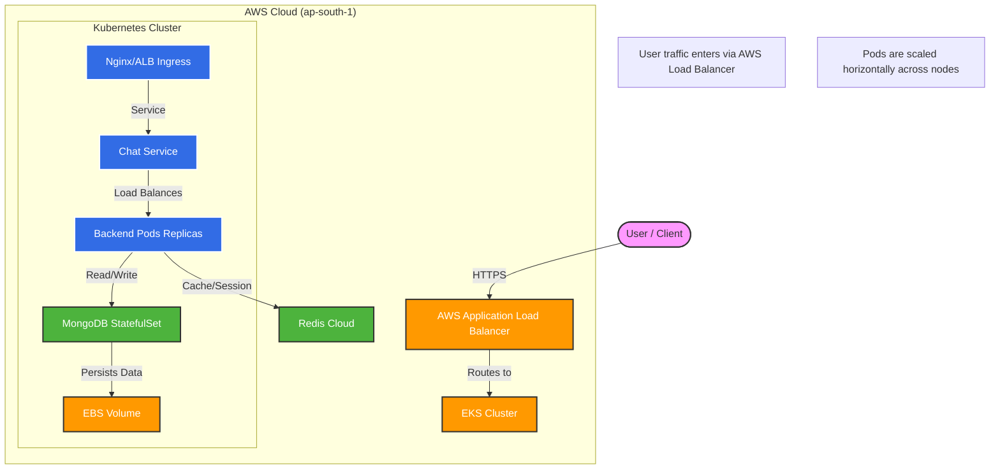
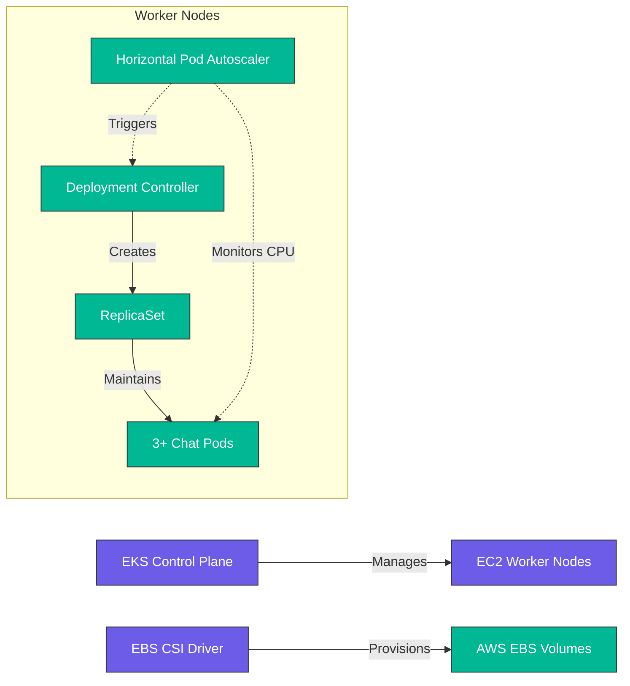
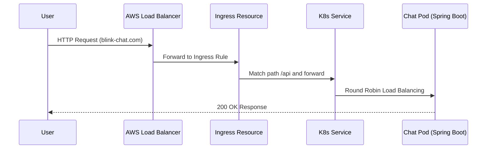

# Blink Chat Service: Kubernetes Production Documentation

Welcome to the official Kubernetes production documentation for **Blink Chat Service**. This guide covers everything from the basic architecture to advanced deployment and operations on AWS EKS.

---

## 📑 Table of Contents

1. [🌟 Project Overview](#-project-overview)
2. [🏗️ System Architecture](#-system-architecture)
    - [Overall System Design](#overall-system-design)
    - [Kubernetes Component Interaction](#kubernetes-component-interaction)
    - [Traffic Flow (User to Pod)](#traffic-flow-user-to-pod)
3. [🛠️ Infrastructure & Setup](#-infrastructure--setup)
    - [Prerequisites](#prerequisites)
    - [AWS Environment Setup](#aws-environment-setup)
4. [🚀 Deployment Strategy](#-deployment-strategy)
    - [CI/CD Flow](#cicd-flow)
    - [Step-by-Step Deployment](#step-by-step-deployment)
5. [📊 Operations & Scaling](#-operations--scaling)
    - [Auto-scaling (HPA)](#auto-scaling-hpa)
    - [Resource Monitoring](#resource-monitoring)
6. [🛡️ Best Practices](#-best-practices)
    - [Security Considerations](#security-considerations)
    - [High Availability](#high-availability)
7. [🔍 Troubleshooting Guide](#-troubleshooting-guide)
8. [🏁 Conclusion](#-conclusion)

---

## 🌟 Project Overview

**Blink Chat Service** is a high-performance Spring Boot application designed to handle real-time communication. It is built to be cloud-native, scalable, and resilient. To achieve this, we use **AWS EKS (Elastic Kubernetes Service)** as our orchestration platform.

### Key Highlights:
- **Scalable**: Handles 100 to 100,000+ users using Horizontal Pod Autoscaling (HPA).
- **Resilient**: Self-healing pods that restart automatically if they crash.
- **Secure**: Uses AWS IAM, Kubernetes Secrets, and Private Subnets.
- **Persistent**: MongoDB storage is backed by AWS EBS (Elastic Block Store).

---

## 🏗️ System Architecture

### Overall System Design
This diagram shows how the user connects to our service and how different components interact.



**Simple Explanation:**
1. The **User** sends a request to a URL.
2. The **AWS Load Balancer (ALB)** receives it and sends it inside the Kubernetes cluster.
3. The **Pods** (running our Java code) process the message.
4. Data is saved in **MongoDB** (Stored on AWS EBS disks) and cached in **Redis**.

---

### Kubernetes Component Interaction
This shows how the internal "brains" of Kubernetes manage our application.



**Simple Explanation:**
- **Control Plane**: The boss that tells everyone what to do.
- **Worker Nodes**: The actual machines (EC2) where our code runs.
- **HPA**: A "watchman" that checks if the CPU is too high. If yes, it adds more pods automatically.
- **CSI Driver**: A bridge that lets Kubernetes talk to AWS disks.

---

### Traffic Flow (User to Pod)
How exactly a request travels from the internet to your code.



**Simple Explanation:**
1. **User** hits the domain.
2. **ALB** checks which "Ingress" rule matches.
3. **Service** acts like a postman, finding which specific **Pod** is free to take the request.

---

## 🛠️ Infrastructure & Setup

### Prerequisites
Before you start, make sure you have these tools installed in your system:
- **AWS CLI**: To talk to your AWS account.
- **eksctl**: The easiest tool to create EKS clusters.
- **kubectl**: The main remote control for Kubernetes.
- **Helm**: Like an "App Store" for Kubernetes.

### AWS Environment Setup
We deploy in a **VPC (Virtual Private Cloud)** with both Public and Private subnets.
- **Public Subnet**: ALB (Load Balancer) lives here so it can talk to the internet.
- **Private Subnet**: Our Database and App Pods live here for maximum security. No one can access them directly from the internet.

---

## 🚀 Deployment Strategy

### CI/CD Flow
When a developer pushes code, this is how it reaches production.

```mermaid
graph LR
    classDef git fill:#f34f29,stroke:#333,color:#fff;
    classDef build fill:#007acc,stroke:#333,color:#fff;
    classDef deploy fill:#00b894,stroke:#333,color:#fff;

    Git[GitHub Push]:::git --> GitHubActions[GitHub Actions Workflow]:::build
    GitHubActions --> Build[Build & Test Java App]:::build
    Build --> Docker[Build Docker Image]:::build
    Docker --> Push[Push to Docker Hub/ECR]:::build
    Push --> K8sApply[kubectl apply -k .]:::deploy
    K8sApply --> Success[Production Live!]:::deploy
```



**Simple Explanation:**
- Once you push code, **GitHub Actions** starts a robot.
- This robot builds the code, runs tests, and creates a **Docker image**.
- Finally, it updates the Kubernetes cluster with the new image.

---

### Step-by-Step Deployment
1. **Configure AWS**: Run `aws configure` to log in.
2. **Create Cluster**: 
   ```bash
   eksctl create cluster --name blink-chat --region ap-south-1 --managed
   ```
3. **Secrets Management**: Encode your passwords in base64 and add them to `secret.yaml`.
   *Why?* We never store plain-text passwords in GitHub.
4. **Apply Manifests**: 
   ```bash
   kubectl apply -k .
   ```

---

## 📊 Operations & Scaling

### Auto-scaling (HPA)
We use **Horizontal Pod Autoscaler**. If your application gets famous and many people start chatting:
- **Metric**: CPU or Memory usage.
- **Action**: Kubernetes will spin up more pods (Min: 3, Max: 10).
- **Benefit**: No manual work needed during traffic spikes.

### Resource Monitoring
- **Metrics Server**: Essential for HPA to see how much "breath" (CPU/RAM) a pod is taking.
- **`kubectl top pods`**: Use this command to see real-time usage.

---

## 🛡️ Best Practices

### Security Considerations
1. **IAM Roles for Service Accounts (IRSA)**: We don't use hardcoded AWS keys. We give the Pod a "Role" just like a person.
2. **Network Policies**: Restrict which pods can talk to each other.
3. **Secret Encryption**: All passwords are encrypted at rest in the cluster.

### High Availability
- **Multi-AZ Deployment**: Our pods are spread across different data centers (Availability Zones). If one data center has a power cut, the other one keeps the app running.
- **Liveness Probes**: Kubernetes keeps "poking" the app to see if it's alive. If it's frozen, it kills and restarts it.

---

## 🔍 Troubleshooting Guide

| Issue | What to check? | Command |
|-------|----------------|---------|
| **Pod is Pending** | No space on nodes (EC2 full) | `kubectl describe pod <name>` |
| **CrashLoopBackOff**| Code error or missing DB config | `kubectl logs <name> --previous` |
| **No ALB Address** | Ingress controller not running | `kubectl logs -n kube-system -l app.kubernetes.io/name=aws-load-balancer-controller` |
| **Database slow** | Persistent Volume (EBS) limits | `kubectl top pods` |

---

## 🏁 Conclusion

This documentation provides a solid foundation for managing **Blink Chat Service** on Kubernetes. By following these patterns, we ensure our application is **Production-Ready, Secure, and Scalable**.

**Next Steps for Developers:**
1. Explore the `k8s/` folder for YAML manifests.
2. Check `TROUBLESHOOTING.md` for specific error codes.
3. Always test your K8s changes in a separate namespace before applying to production.

---
*Generated for Blink Chat Team - DevOps Division*
