```mermaid
graph TB
    HPA[HPA] -->|Monitors| Metrics[Metrics Server]
    Metrics -->|CPU: 80%| HPA
    HPA -->|Scale up| Deployment[Deployment<br/>3 → 5 pods]
    Deployment -->|Creates| NewPods[New Pods]
    
    Metrics -->|CPU: 30%| HPA2[HPA]
    HPA2 -->|Scale down| Deployment2[Deployment<br/>5 → 3 pods]
```

# EKS & Kubernetes Concepts Explained

Complete guide to all technologies and concepts used in this deployment.
This document explains why we chose specific Kubernetes objects for the **Blink Chat Service** and how they function within our architecture.

> **Note**: For high-level architecture diagrams, please refer to the **[Blink-K8S.md](Blink-K8S.md)**.

---

## 📑 Table of Contents

1. [AWS CLI](#aws-cli)
2. [AWS VPC](#aws-vpc)
3. [AWS EKS](#aws-eks)
4. [eksctl](#eksctl)
5. [kubectl](#kubectl)
6. [kubeconfig](#kubeconfig)
7. [Namespaces](#namespaces)
8. [Helm](#helm)
9. [Deployments](#deployments)
10. [StatefulSets](#statefulsets)
11. [Services](#services)
12. [Ingress & ALB](#ingress--alb)
13. [Persistent Volumes](#persistent-volumes)
14. [ConfigMaps & Secrets](#configmaps--secrets)
15. [HPA (Auto-scaling)](#hpa-auto-scaling)
16. [Metrics Server](#metrics-server)

---

## AWS CLI

### What is it?
Command-line tool to interact with AWS services.

### Why use it?
- Create and manage AWS resources from terminal
- Automate AWS tasks
- Required for EKS cluster management

### Installation
```bash
# Check if installed
aws --version

# Configure credentials
aws configure
# Enter: Access Key, Secret Key, Region (ap-south-1), Output format (json)
```

### Common Commands
```bash
# Check current user
aws sts get-caller-identity

# List EKS clusters
aws eks list-clusters --region ap-south-1

# Get kubeconfig
aws eks update-kubeconfig --name blink-chat-service --region ap-south-1

# List EC2 instances
aws ec2 describe-instances --region ap-south-1

# List IAM policies
aws iam list-policies --query 'Policies[?PolicyName==`AWSLoadBalancerControllerIAMPolicy`]'

# Create IAM policy version
aws iam create-policy-version \
  --policy-arn arn:aws:iam::ACCOUNT_ID:policy/PolicyName \
  --policy-document file://policy.json \
  --set-as-default
```

---

## AWS VPC

### What is it?
Virtual Private Cloud - your own isolated network in AWS cloud.

### Why use it?
- Isolate your resources from other AWS customers
- Control network traffic (public/private subnets)
- Secure communication between services

### How it works


### Key Components
- **Subnets**: Divide VPC into smaller networks
  - **Public**: Has internet access (ALB lives here)
  - **Private**: No direct internet (EKS nodes live here)
- **Internet Gateway (IGW)**: Allows public subnet to access internet
- **NAT Gateway**: Allows private subnet to access internet (outbound only)
- **Route Tables**: Define traffic routing rules

### Common Commands
```bash
# List VPCs
aws ec2 describe-vpcs --region ap-south-1

# List subnets
aws ec2 describe-subnets --region ap-south-1

# Get VPC for EKS cluster
aws eks describe-cluster --name blink-chat-service --region ap-south-1 \
  --query 'cluster.resourcesVpcConfig.vpcId'
```

---

## AWS EKS

### What is it?
Elastic Kubernetes Service - managed Kubernetes on AWS.

### Why use it?
- AWS manages Kubernetes control plane (master nodes)
- Automatic updates and patches
- Integrated with AWS services (ALB, EBS, IAM)
- High availability across multiple AZs

### Architecture


### Common Commands
```bash
# List clusters
aws eks list-clusters --region ap-south-1

# Describe cluster
aws eks describe-cluster --name blink-chat-service --region ap-south-1

# List node groups
aws eks list-nodegroups --cluster-name blink-chat-service --region ap-south-1

# Describe node group
aws eks describe-nodegroup \
  --cluster-name blink-chat-service \
  --nodegroup-name standard-workers \
  --region ap-south-1
```

---

## eksctl

### What is it?
Official CLI tool to create and manage EKS clusters.

### Why use it?
- Simplifies cluster creation (handles VPC, subnets, IAM automatically)
- One command to create entire cluster
- Manages node groups easily

### Common Commands
```bash
# Create cluster
eksctl create cluster \
  --name blink-chat-service \
  --region ap-south-1 \
  --nodegroup-name standard-workers \
  --node-type t3.medium \
  --nodes 2 \
  --nodes-min 2 \
  --nodes-max 4 \
  --managed

# List clusters
eksctl get cluster --region ap-south-1

# Delete cluster (deletes everything)
eksctl delete cluster --name blink-chat-service --region ap-south-1

# List node groups
eksctl get nodegroup --cluster blink-chat-service --region ap-south-1

# Scale node group
eksctl scale nodegroup \
  --cluster blink-chat-service \
  --name standard-workers \
  --nodes 3 \
  --region ap-south-1

# Create IAM service account
eksctl create iamserviceaccount \
  --cluster blink-chat-service \
  --namespace kube-system \
  --name aws-load-balancer-controller \
  --attach-policy-arn arn:aws:iam::ACCOUNT_ID:policy/AWSLoadBalancerControllerIAMPolicy \
  --approve \
  --region ap-south-1
```

---

## kubectl

### What is it?
Kubernetes command-line tool to interact with clusters.

### Why use it?
- Deploy applications
- View logs and debug
- Manage resources (pods, services, etc.)

### Common Commands

#### Cluster Info
```bash
# View cluster info
kubectl cluster-info

# View nodes
kubectl get nodes

# View all resources in namespace
kubectl get all -n blink-chat
```

#### Deployments & Pods
```bash
# List deployments
kubectl get deployments -n blink-chat

# List pods
kubectl get pods -n blink-chat

# Watch pods (live updates)
kubectl get pods -n blink-chat -w

# Describe pod (detailed info)
kubectl describe pod <pod-name> -n blink-chat

# Get pod logs
kubectl logs <pod-name> -n blink-chat

# Follow logs (live)
kubectl logs -f <pod-name> -n blink-chat

# Get logs from deployment
kubectl logs deployment/chat-service -n blink-chat --tail=50

# Execute command in pod
kubectl exec -it <pod-name> -n blink-chat -- bash

# Port forward to pod
kubectl port-forward <pod-name> 8080:8080 -n blink-chat
```

#### Apply & Delete
```bash
# Apply single file
kubectl apply -f deployment.yaml

# Apply directory
kubectl apply -f k8s/

# Apply with Kustomize
kubectl apply -k .

# Delete resources
kubectl delete -f deployment.yaml

# Delete namespace (deletes everything inside)
kubectl delete namespace blink-chat
```

#### Services & Ingress
```bash
# List services
kubectl get svc -n blink-chat

# List ingress
kubectl get ingress -n blink-chat

# Describe ingress
kubectl describe ingress blink-chat-ingress -n blink-chat
```

#### Debugging
```bash
# Get events
kubectl get events -n blink-chat --sort-by='.lastTimestamp'

# Describe node
kubectl describe node <node-name>

# Get resource usage
kubectl top nodes
kubectl top pods -n blink-chat

# Restart deployment
kubectl rollout restart deployment/chat-service -n blink-chat

# Check rollout status
kubectl rollout status deployment/chat-service -n blink-chat
```

---

## kubeconfig

### What is it?
Configuration file that stores cluster connection details.

### Why use it?
- kubectl uses it to know which cluster to connect to
- Stores authentication credentials
- Can manage multiple clusters

### Location
- **Linux/Mac**: `~/.kube/config`
- **Windows**: `C:\Users\<username>\.kube\config`

### Common Commands
```bash
# View current context
kubectl config current-context

# List all contexts
kubectl config get-contexts

# Switch context
kubectl config use-context <context-name>

# Update kubeconfig for EKS
aws eks update-kubeconfig --name blink-chat-service --region ap-south-1

# View kubeconfig
kubectl config view
```

---

## Namespaces

### What is it?
Virtual clusters within a Kubernetes cluster.

### Why use it?
- Organize resources (dev, staging, prod)
- Isolate teams or applications
- Apply resource quotas per namespace

### Common Commands
```bash
# List namespaces
kubectl get namespaces

# Create namespace
kubectl create namespace blink-chat

# Delete namespace
kubectl delete namespace blink-chat

# Set default namespace
kubectl config set-context --current --namespace=blink-chat

# Get resources in namespace
kubectl get all -n blink-chat

# Get resources in all namespaces
kubectl get pods --all-namespaces
```

---

## Helm

### What is it?
Package manager for Kubernetes (like apt/yum for Linux).

### Why use it?
- Install complex applications with one command
- Manage application versions
- Share Kubernetes applications

### Common Commands
```bash
# Add repository
helm repo add eks https://aws.github.io/eks-charts

# Update repositories
helm repo update

# Search for charts
helm search repo aws-load-balancer-controller

# Install chart
helm install aws-load-balancer-controller eks/aws-load-balancer-controller \
  -n kube-system \
  --set clusterName=blink-chat-service

# List installed releases
helm list -n kube-system

# Uninstall release
helm uninstall aws-load-balancer-controller -n kube-system

# Get values
helm get values aws-load-balancer-controller -n kube-system

# Upgrade release
helm upgrade aws-load-balancer-controller eks/aws-load-balancer-controller \
  -n kube-system \
  --set clusterName=blink-chat-service
```

---

## Deployments

### What is it?
Manages a set of identical pods (replicas).

### Why use it?
- Run multiple copies of your application
- Rolling updates (zero downtime)
- Automatic pod replacement if one crashes

### How it works


### Common Commands
```bash
# Get deployments
kubectl get deployments -n blink-chat

# Scale deployment
kubectl scale deployment chat-service --replicas=5 -n blink-chat

# Update image
kubectl set image deployment/chat-service \
  chat-service=raajkr07/blink-chat-service:new-tag \
  -n blink-chat

# Rollback deployment
kubectl rollout undo deployment/chat-service -n blink-chat

# View rollout history
kubectl rollout history deployment/chat-service -n blink-chat
```

---

## StatefulSets

### What is it?
Like Deployment, but for stateful applications (databases).

### Why use it?
- Stable network identity (pod names don't change)
- Persistent storage per pod
- Ordered deployment and scaling

### Deployment vs StatefulSet

| Feature | Deployment | StatefulSet |
|---------|-----------|-------------|
| Pod names | Random (chat-service-abc123) | Ordered (mongodb-0, mongodb-1) |
| Storage | Shared or ephemeral | Dedicated PVC per pod |
| Use case | Stateless apps | Databases, queues |

### Common Commands
```bash
# Get StatefulSets
kubectl get statefulsets -n blink-chat

# Scale StatefulSet
kubectl scale statefulset mongodb --replicas=3 -n blink-chat

# Delete StatefulSet (keeps PVCs)
kubectl delete statefulset mongodb -n blink-chat

# Delete StatefulSet and PVCs
kubectl delete statefulset mongodb -n blink-chat
kubectl delete pvc mongo-storage-mongodb-0 -n blink-chat
```

---

## Services

### What is it?
Stable network endpoint to access pods.

### Why use it?
- Pods have changing IPs (when they restart)
- Service provides stable DNS name
- Load balances traffic across pods

### Service Types


### Common Commands
```bash
# Get services
kubectl get svc -n blink-chat

# Describe service
kubectl describe svc chat-service -n blink-chat

# Get service endpoints (pod IPs)
kubectl get endpoints chat-service -n blink-chat

# Delete service
kubectl delete svc chat-service -n blink-chat
```

---

## Ingress & ALB

### What is it?
- **Ingress**: Kubernetes resource to route HTTP traffic
- **ALB**: AWS Application Load Balancer (Layer 7)

### Why use it?
- Single entry point for multiple services
- Path-based routing (/api → backend, /admin → admin-service)
- SSL/TLS termination
- Cost-effective (one ALB for multiple services)

### How it works


### Common Commands
```bash
# Get ingress
kubectl get ingress -n blink-chat

# Describe ingress
kubectl describe ingress blink-chat-ingress -n blink-chat

# Get ALB DNS
kubectl get ingress blink-chat-ingress -n blink-chat \
  -o jsonpath='{.status.loadBalancer.ingress[0].hostname}'

# Check ALB controller logs
kubectl logs -n kube-system deployment/aws-load-balancer-controller --tail=50
```

---

## Persistent Volumes

### What is it?
Storage that persists even when pods are deleted.

### Why use it?
- Database data must survive pod restarts
- Share data between pods
- Backup and restore data

### How it works


### Components
- **PVC (PersistentVolumeClaim)**: Request for storage (I need 10GB)
- **PV (PersistentVolume)**: Actual storage (Here's your 10GB EBS volume)
- **StorageClass**: How to create PV (Use AWS EBS gp3 type)

### Common Commands
```bash
# Get PVCs
kubectl get pvc -n blink-chat

# Get PVs
kubectl get pv

# Describe PVC
kubectl describe pvc mongo-storage-mongodb-0 -n blink-chat

# Delete PVC (deletes EBS volume)
kubectl delete pvc mongo-storage-mongodb-0 -n blink-chat

# Get storage classes
kubectl get storageclass
```

---

## ConfigMaps & Secrets

### What is it?
- **ConfigMap**: Store non-sensitive configuration
- **Secret**: Store sensitive data (passwords, keys)

### Why use it?
- Separate configuration from code
- Change config without rebuilding image
- Secrets are base64 encoded

### Common Commands
```bash
# Get ConfigMaps
kubectl get configmap -n blink-chat

# View ConfigMap
kubectl describe configmap chat-service-config -n blink-chat

# Get Secrets
kubectl get secrets -n blink-chat

# View Secret (base64 encoded)
kubectl get secret chat-service-secret -n blink-chat -o yaml

# Decode secret
kubectl get secret chat-service-secret -n blink-chat \
  -o jsonpath='{.data.JWT_SECRET}' | base64 -d

# Create secret from literal
kubectl create secret generic my-secret \
  --from-literal=password=mypassword \
  -n blink-chat

# Create secret from file
kubectl create secret generic my-secret \
  --from-file=./secret.txt \
  -n blink-chat
```

---

## HPA (Auto-scaling)

### What is it?
Horizontal Pod Autoscaler - automatically scales pods based on metrics.

### Why use it?
- Handle traffic spikes automatically
- Save costs during low traffic
- Maintain performance under load

### How it works



### Common Commands
```bash
# Get HPA
kubectl get hpa -n blink-chat

# Describe HPA
kubectl describe hpa chat-service-hpa -n blink-chat

# Create HPA
kubectl autoscale deployment chat-service \
  --cpu-percent=70 \
  --min=3 \
  --max=10 \
  -n blink-chat

# Delete HPA
kubectl delete hpa chat-service-hpa -n blink-chat
```

---

## Metrics Server

### What is it?
Collects resource metrics (CPU, memory) from pods and nodes.

### Why use it?
- Required for HPA to work
- View resource usage with `kubectl top`
- Monitor cluster health

### Common Commands
```bash
# Install Metrics Server
kubectl apply -f https://github.com/kubernetes-sigs/metrics-server/releases/latest/download/components.yaml

# Check if running
kubectl get deployment metrics-server -n kube-system

# View node metrics
kubectl top nodes

# View pod metrics
kubectl top pods -n blink-chat

# View pod metrics with containers
kubectl top pods -n blink-chat --containers
```

---

## Summary

This guide covered all major Kubernetes and AWS concepts used in the deployment. For step-by-step deployment instructions, see [DEPLOYMENT-STEPS.md](DEPLOYMENT-STEPS.md).

**Key Takeaways:**
- **EKS** = Managed Kubernetes on AWS
- **Deployments** = Stateless apps (backend)
- **StatefulSets** = Stateful apps (databases)
- **Services** = Stable network endpoint
- **Ingress + ALB** = External access
- **PVC + PV** = Persistent storage
- **HPA** = Auto-scaling
