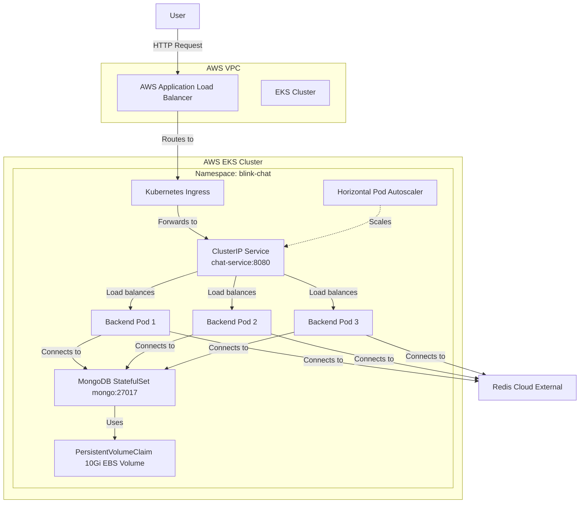

# Blink Chat Service: Kubernetes Infrastructure

Welcome to the Kubernetes infrastructure repository for the **Blink Chat Service**. This directory contains all the manifests and guides required to deploy and manage the service on AWS EKS.

---

## 🧭 Documentation Portal

To avoid redundancy, our documentation is split into specialized guides. Please choose the one that fits your current needs:

### 1. 📖 **[Blink-K8S-Architecture.md](Blink-K8S.md)** (Master Guide)
**Use this for**: High-level architecture, system design diagrams, traffic flow, and best practices. This is the primary source of truth.

### 2. 🚀 **[DEPLOYMENT-STEPS.md](DEPLOYMENT-STEPS.md)** (The Runbook)
**Use this for**: Step-by-step commands to set up the cluster, install controllers, and deploy the application from scratch.

### 3. 🧠 **[EKS-CONCEPTS.md](EKS-CONCEPTS.md)** (Terminology)
**Use this for**: Understanding the specific Kubernetes and AWS terms used in this project (Deployments, StatefulSets, PVCs, etc.).

### 4. 🛠️ **[TROUBLESHOOTING.md](TROUBLESHOOTING.md)** (Issue Resolver)
**Use this for**: Solving specific error messages like `CrashLoopBackOff`, `Pending` pods, or Load Balancer issues.

---

## ⚡ Quick Deployment

If your environment is already configured:

```bash
# Navigate to this directory
cd k8s

# Apply all resources using Kustomize
kubectl apply -k .
```

## 🏗️ Architecture Overview



---

## 🎯 What You'll Deploy

### Application Components
- **Backend**: Spring Boot REST API (3-10 replicas with auto-scaling)
- **Database**: MongoDB StatefulSet with persistent storage
- **Cache**: Redis Cloud (external managed service)
- **Load Balancer**: AWS ALB for external access

### Infrastructure
- **EKS Cluster**: Managed Kubernetes on AWS
- **Node Group**: 2 t3.medium EC2 instances
- **Storage**: EBS volumes for MongoDB data
- **Networking**: VPC with public/private subnets

---
*Last Updated: February 2026*
